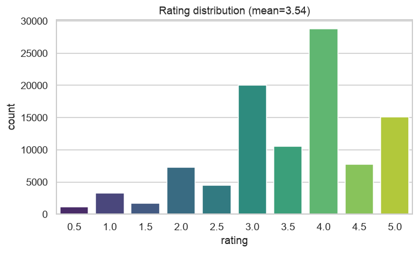
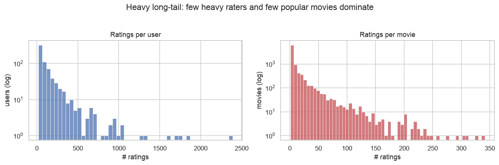
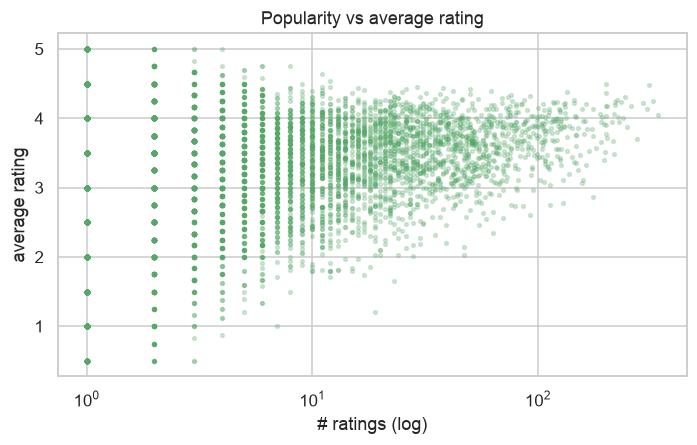
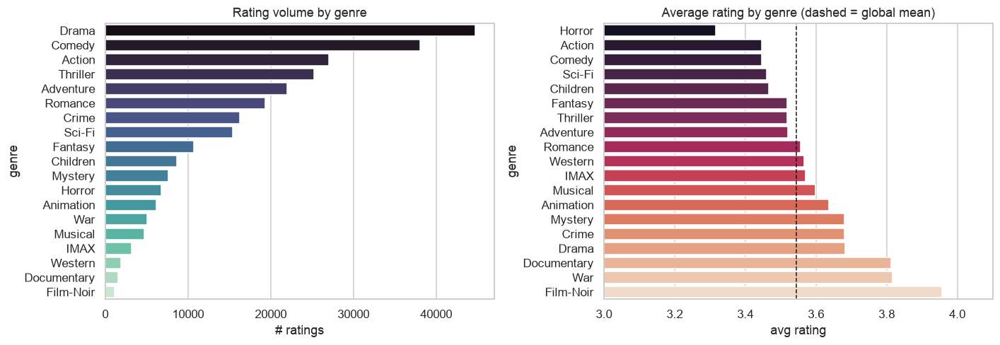
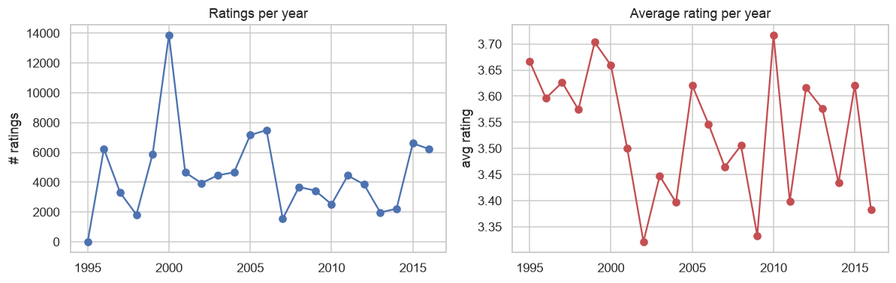

# Phase 1 — Data Analysis & Exploration

MovieLens (100K-scale, CSV distribution: ratings + movies + tags). Generated by `src/eda.py`.

## 1a. Data overview

- ratings: 100,004 | users: 671 | movies: 9,066
- rating scale: [np.float64(0.5), np.float64(1.0), np.float64(1.5), np.float64(2.0), np.float64(2.5), np.float64(3.0), np.float64(3.5), np.float64(4.0), np.float64(4.5), np.float64(5.0)] (half-star)
- user–item matrix sparsity: **1.644%** filled (extremely sparse).
- time span: 1995–2016 | genres: 20

## 1b. Rating distribution

- global mean rating **3.54**; ratings skew positive (4.0 is the mode). A global-mean predictor already sets the RMSE bar.

## 1c. Long-tail activity (users & movies)

- ratings/user: min 20, median 71, max 2391
- ratings/movie: min 1, median 3, max 341 — **66% of movies have ≤5 ratings** (cold-start / long tail).

## 1d. Popularity vs. average rating

- Sparsely-rated movies show extreme average ratings (1 rater → 0.5 or 5.0); popular movies regress toward ~3.5–4.0. Motivates a **bias/shrinkage baseline** and a minimum-support filter for CF.

## 1e. Genre analysis

- Most-rated genres: Drama, Comedy, Action, Thriller, Adventure. Highest-rated tend to be Film-Noir/War/Documentary; lowest Horror/Comedy.

## 1f. Temporal trends

## 1g. Takeaways → modeling

- The matrix is **1.64% dense** → collaborative filtering must handle sparsity and cold-start.
- Positive rating skew (mean 3.54) → subtract global/user/item biases before modeling.
- Long tail: 66% of movies have ≤5 ratings → apply a minimum-support filter for kNN CF
  and rely on latent factors (matrix factorization) to generalize.
- Two evaluation tasks: **rating prediction** (RMSE/MAE) and **top-N recommendation** (Precision@K,
  Recall@K, NDCG@K) with a per-user hold-out.
- Genres enable a content baseline and a hybrid fallback for cold-start items.
