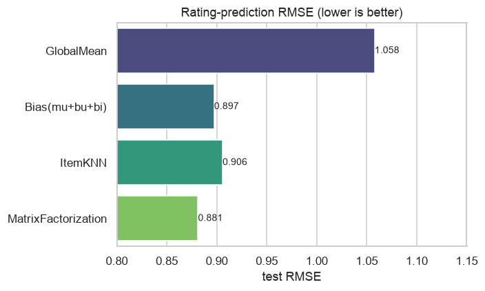
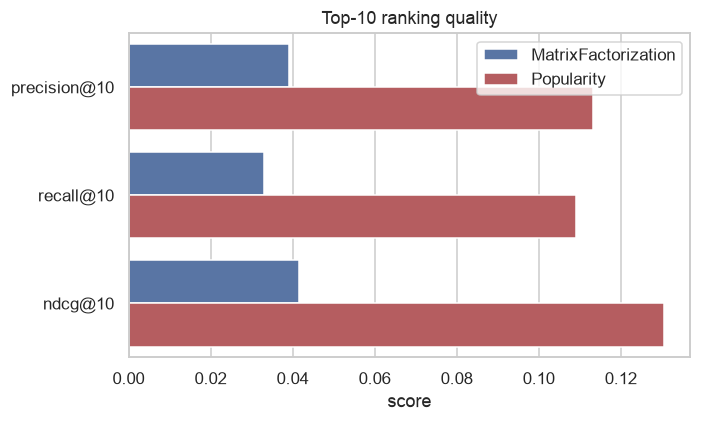

# Phase 4 — Recommender results

- 80/20 random hold-out; 80,099 train / 19,905 test ratings.

## Rating prediction (lower is better)

| model | RMSE | MAE |
|---|---|---|
| GlobalMean | 1.0578 | 0.8488 |
| Bias(mu+bu+bi) | 0.8974 | 0.6930 |
| ItemKNN | 0.9058 | 0.6842 |
| MatrixFactorization | 0.8813 | 0.6759 |

## Top-10 recommendation (relevant = held-out rating ≥ 4)

| model | Precision@10 | Recall@10 | NDCG@10 |
|---|---|---|---|
| MatrixFactorization | 0.0391 | 0.0331 | 0.0415 |
| Popularity | 0.1133 | 0.1090 | 0.1304 |

**Best rating predictor: `MatrixFactorization` (RMSE 0.8813).** On top-10 ranking (rankable pool ≥10 ratings), the popularity baseline leads (MF P@10=0.039 vs Popularity 0.113) — a reminder that RMSE-optimal models are not automatically ranking-optimal.
